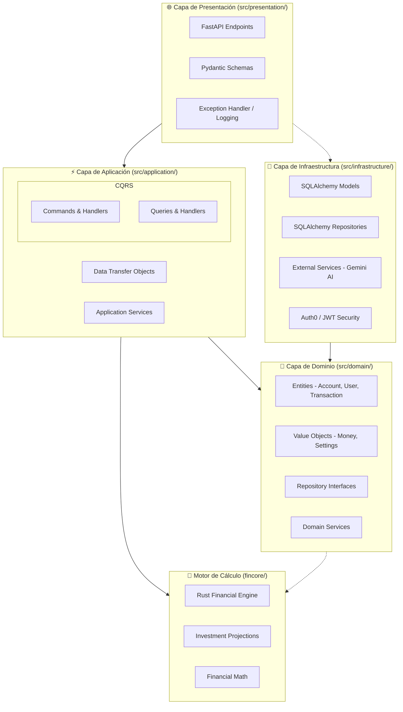
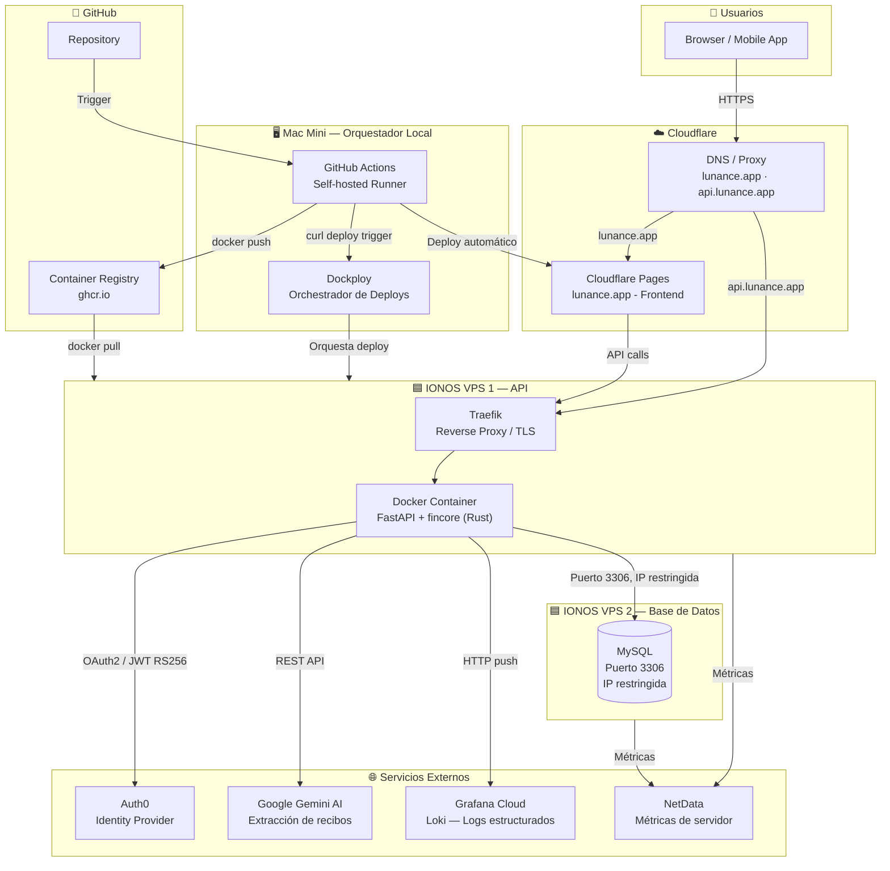
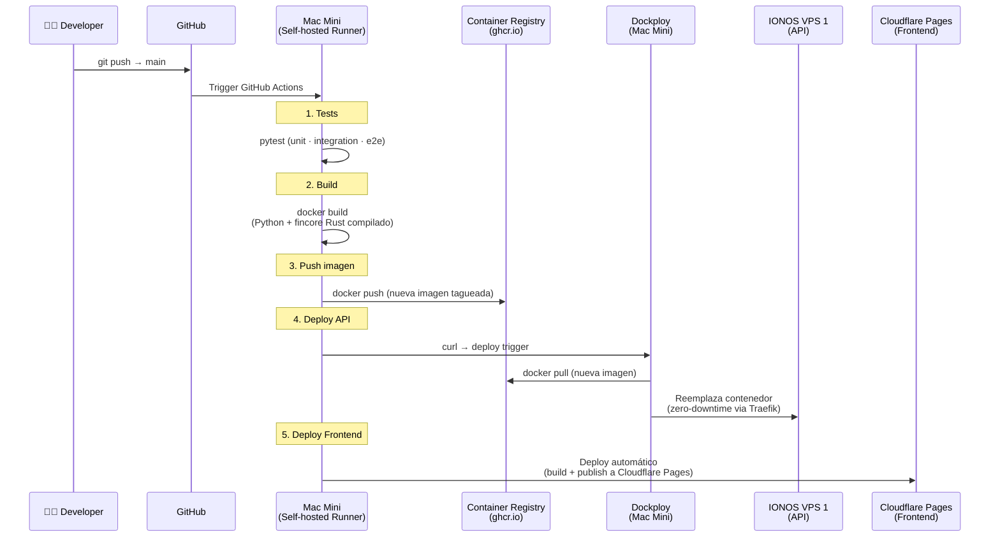
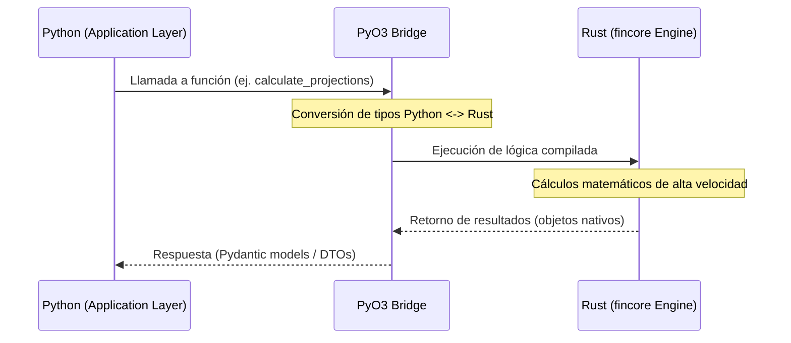
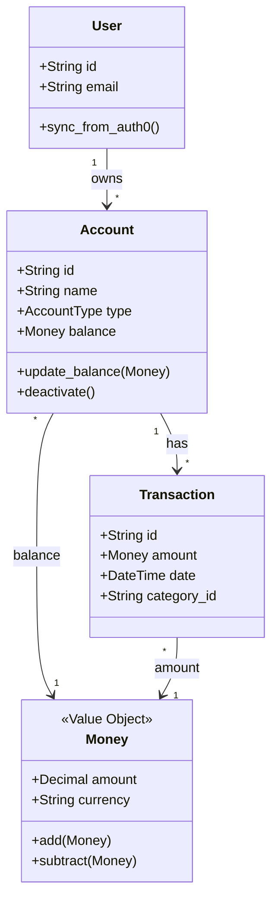
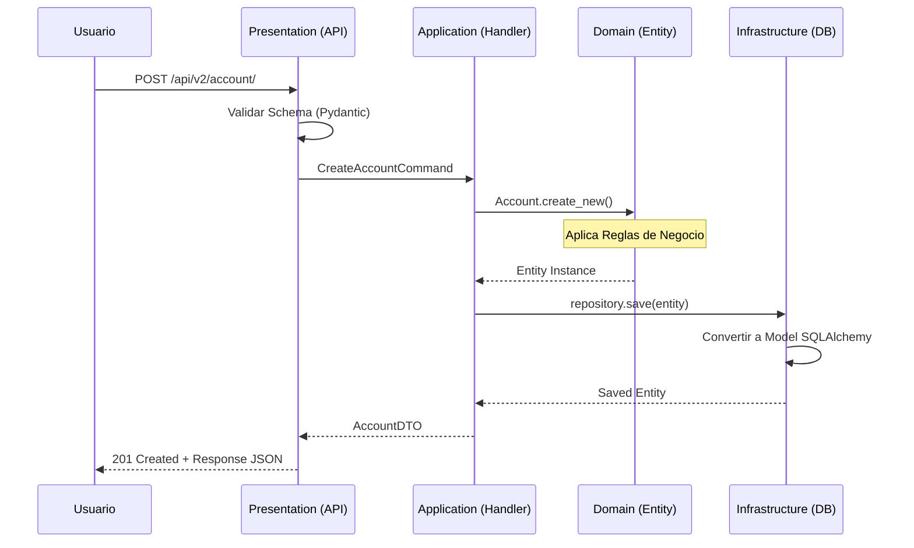
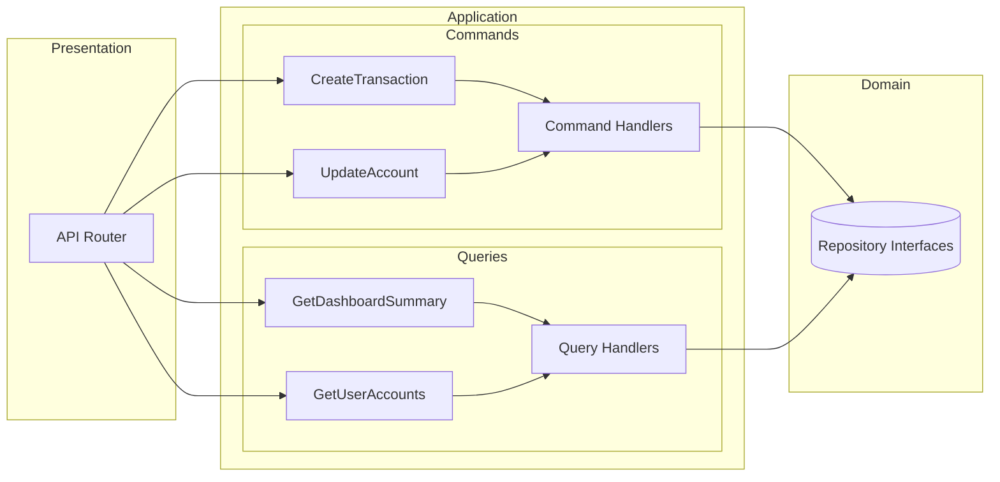
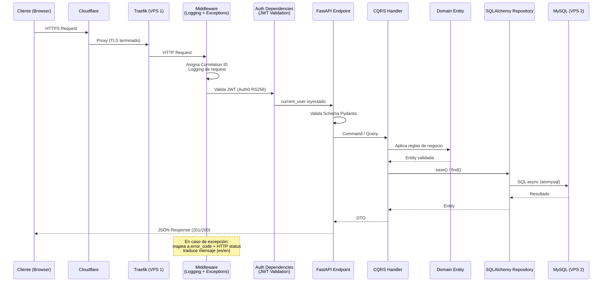

# 🏗️ Arquitectura Técnica - Lunance IA

## Introducción

Este documento describe la arquitectura técnica detallada de Lunance IA, incluyendo la estructura interna de cada capa, patrones de diseño implementados, y las decisiones arquitectónicas tomadas para construir un sistema robusto y escalable.

## 🗺️ Visión General Visual



## 🏗️ Arquitectura de Infraestructura

Vista completa del sistema desplegado en producción, incluyendo todos los servicios y su comunicación.



### Descripción de Componentes

| Componente | Tecnología | Rol |
| :--- | :--- | :--- |
| **Cloudflare DNS/Proxy** | Cloudflare | DNS autoritativo + proxy para `lunance.app` y `api.lunance.app` (dominio comprado en IONOS) |
| **Frontend** | Cloudflare Pages | SPA servida en el edge global |
| **Reverse Proxy** | Traefik (via Dockploy) | Terminación TLS, enrutamiento HTTP hacia el contenedor de la API |
| **API Container** | Docker (FastAPI + fincore) | Contenedor principal de la aplicación en VPS 1 de IONOS |
| **Base de Datos** | MySQL en IONOS VPS 2 | Solo acepta conexiones desde la IP del VPS 1 (puerto 3306) y SSH |
| **Autenticación** | Auth0 | Proveedor de identidad; la API valida JWTs emitidos por Auth0 |
| **IA** | Google Gemini | Extracción de datos de recibos/tickets vía imagen |
| **Logs** | Grafana Cloud (Loki) | Ingesta de logs estructurados desde la API |
| **Métricas** | NetData | Métricas de infraestructura de ambos VPS |
| **Orquestador** | Dockploy (Mac Mini) | Gestiona el ciclo de vida de los contenedores en los VPS de IONOS |

---

## 🚀 Pipeline CI/CD

Todo el pipeline corre en un **GitHub Actions self-hosted** ejecutado en un **Mac Mini local**, que actúa como runner y orquestador del deploy.



### Decisiones de Infraestructura

- **Self-hosted runner en Mac Mini**: Evita los costos de runners en la nube y aprovecha la potencia local para compilar el módulo Rust (`fincore`) que requiere tiempo de compilación.
- **Dockploy como orquestador**: Alternativa liviana a Kubernetes/ECS que gestiona contenedores en VPS sin costo adicional de plataforma.
- **VPS separado para DB**: Aislamiento de la base de datos con reglas de firewall estrictas (solo IP de la API y SSH).
- **Cloudflare Pages para Frontend**: CDN global sin costo, con deploy automático desde GitHub Actions.
- **Cloudflare DNS sobre IONOS**: Aprovecha el proxy de Cloudflare para protección DDoS y ocultamiento de IP del servidor, aunque el dominio esté comprado en IONOS.

---

## 🦀 Arquitectura Híbrida (Python + Rust)

### Visión General

Lunance IA utiliza un enfoque híbrido para maximizar tanto la velocidad de desarrollo como el rendimiento computacional. Mientras que **Python** actúa como el orquestador principal (manejando la API, la lógica de negocio y la persistencia), **Rust** se encarga de los cálculos financieros pesados a través del módulo `fincore`.

> ⚠️ **Estado Beta**: La implementación de Rust está actualmente en fase beta. El objetivo a largo plazo es migrar todos los cálculos matemáticos y financieros críticos al motor de Rust para garantizar máxima precisión y velocidad.

### Flujo de Interacción



### 🎯 Responsabilidades por Lenguaje

| Característica | 🐍 Python (Orquestador) | 🦀 Rust (Motor Core) |
| :--- | :--- | :--- |
| **API & Routing** | FastAPI (Rápido desarrollo) | - |
| **Persistencia** | SQLAlchemy (Async MySQL) | - |
| **Lógica de Negocio** | CQRS, Reglas de Dominio | - |
| **Cálculos Financieros** | Orquestación | **Rendimientos, Proyecciones** |
| **Simulaciones** | - | **Monte Carlo, Escenarios** |
| **Validación Tipos** | Pydantic | **Tipado fuerte y memoria segura** |

### 🛠️ Integración Técnica

El módulo `fincore` se integra en el ecosistema Python utilizando:
- **PyO3**: Para crear bindings nativos de Rust para Python.
- **Maturin**: Como sistema de construcción y publicación del paquete Rust.
- **uv**: Maneja la instalación del módulo compilado de forma transparente.

## 📁 Estructura Detallada del Proyecto

### 🎯 Capa de Dominio (`src/domain/`)

La capa de dominio contiene la lógica de negocio pura sin dependencias externas.



```
domain/
├── entities/                          # Entidades de negocio con identidad
│   ├── __init__.py
│   ├── account.py                    # Entidad Account con reglas de negocio
│   ├── bank.py                       # Entidad Bank (metadatos bancarios)
│   ├── category.py                   # Entidad Category (clasificación de transacciones)
│   ├── dashboard.py                  # Entidad Dashboard (resumen financiero agregado)
│   ├── investment_yield.py           # Entidad InvestmentYield (rendimientos diarios)
│   ├── subscription.py              # Entidad Subscription (pagos recurrentes)
│   ├── subscription_charge.py       # Entidad SubscriptionCharge (cargos individuales)
│   ├── transaction.py               # Entidad Transaction con cálculos
│   └── user.py                      # Entidad User con validaciones
├── objects/                          # Value Objects inmutables
│   ├── __init__.py
│   ├── credit_card_settings.py      # Configuración de tarjetas de crédito
│   ├── enums.py                     # Enumeraciones de negocio (AccountType, InterestType, etc.)
│   ├── investment_settings.py       # Configuración de inversiones (tasa, tipo interés, base_principal)
│   └── money.py                     # Value Object Money con validaciones
├── repositories/                     # Interfaces abstractas para persistencia
│   ├── __init__.py
│   ├── account_repository.py        # Interface para operaciones de Account
│   ├── auth_token_repository.py     # Interface para tokens JWT/refresh
│   ├── bank_repository.py           # Interface para operaciones de Bank
│   ├── category_repository.py       # Interface para operaciones de Category
│   ├── credit_card_repository.py    # Interface para configuración de tarjetas de crédito
│   ├── dashboard_repository.py      # Interface para datos agregados del dashboard
│   ├── investment_card_repository.py # Interface para configuración de inversiones
│   ├── investment_yield_repository.py # Interface para rendimientos de inversión
│   ├── subscription_charge_repository.py # Interface para cargos de suscripción
│   ├── subscription_repository.py   # Interface para operaciones de Subscription
│   ├── transaction_repository.py    # Interface para operaciones de Transaction
│   └── user_repository.py          # Interface para operaciones de User
└── services/                        # Servicios de dominio
    ├── __init__.py
    └── account_service.py           # Lógica compleja entre entidades
```

#### Características del Dominio:
- **Sin dependencias externas**: Solo usa tipos nativos de Python
- **Reglas de negocio centralizadas**: Todas las validaciones en un lugar
- **Inmutabilidad**: Value Objects son inmutables por diseño
- **Interfaces puras**: Contratos sin implementación específica
- **13 repositorios abstractos**: Contratos completos para cada agregado

### ⚡ Capa de Aplicación (`src/application/`)

Orquesta casos de uso utilizando el patrón CQRS, organizada por feature/dominio.



```
application/
├── accounts/                  # Feature: Gestión de cuentas
│   ├── __init__.py
│   ├── commands/             # Operaciones de escritura de cuentas
│   │   ├── __init__.py
│   │   ├── create_account.py      # Crear cuenta (+ settings de crédito/inversión)
│   │   ├── update_account.py      # Actualizar cuenta
│   │   ├── delete_account.py      # Eliminar cuenta
│   │   └── state_account.py       # Cambiar estado de cuenta
│   └── queries/              # Operaciones de lectura de cuentas
│       ├── __init__.py
│       ├── get_account_by_id.py   # Consultar cuenta por ID
│       └── get_user_accounts.py   # Consultar cuentas de usuario
├── transactions/             # Feature: Gestión de transacciones
│   ├── __init__.py
│   ├── commands/             # Operaciones de escritura de transacciones
│   │   ├── __init__.py
│   │   ├── create_transaction.py  # Crear transacción (+ actualiza base_principal en inversiones)
│   │   ├── update_transaction.py
│   │   └── delete_transaction.py
│   └── queries/              # Operaciones de lectura de transacciones
│       ├── __init__.py
│       ├── get_transactions.py
│       └── get_transaction_by_uuid.py
├── subscriptions/            # Feature: Gestión de suscripciones
│   ├── __init__.py
│   ├── commands/
│   │   ├── __init__.py
│   │   ├── create_subscription.py
│   │   ├── update_subscription.py
│   │   ├── delete_subscription.py
│   │   └── state_subscription.py  # Activar/desactivar suscripción
│   ├── queries/
│   │   ├── __init__.py
│   │   ├── get_subscriptions.py
│   │   ├── get_subscriptions_by_id.py
│   │   └── get_subscription_charges.py  # Historial de cargos
│   └── services/
│       └── subscription_processor.py    # Procesamiento automático de suscripciones
├── investments/              # Feature: Gestión de rendimientos de inversión
│   ├── __init__.py
│   ├── commands/
│   │   ├── __init__.py
│   │   └── generate_daily_yields.py  # Generación diaria de rendimientos (scheduled)
│   └── queries/
│       ├── __init__.py
│       ├── get_investment_yields.py       # Consultar rendimientos históricos
│       └── get_investment_projections.py  # Proyecciones de inversión
├── banks/                    # Feature: Catálogo de bancos
│   ├── __init__.py
│   └── queries/
│       ├── __init__.py
│       └── get_banks.py
├── auth/                     # Feature: Autenticación (Auth0)
│   ├── __init__.py
│   └── commands/
│       ├── __init__.py
│       ├── login.py          # Autenticación de usuario
│       ├── logout.py         # Cerrar sesión
│       ├── refresh_token.py  # Renovar token
│       └── register.py       # Registro de usuario
├── categories/               # Feature: Gestión de categorías
│   ├── __init__.py
│   └── queries/
│       ├── __init__.py
│       └── get_categories.py
├── dashboard/                # Feature: Dashboard y resumen
│   ├── __init__.py
│   └── queries/
│       ├── __init__.py
│       └── get_dashboard_summary.py
├── dto/                      # Data Transfer Objects (compartidos)
│   ├── __init__.py
│   ├── account_dto.py
│   ├── bank_dto.py
│   ├── category_dto.py
│   ├── investment_yield_dto.py
│   ├── subscription_dto.py
│   └── transaction_dto.py
└── interfaces/               # Interfaces de aplicación
    └── __init__.py
```

#### Características de Aplicación:
- **Organización por Feature**: Cada dominio tiene su propia carpeta con comandos y queries
- **Separación CQRS**: Comandos (escritura) y queries (lectura) claramente separados
- **DTOs Centralizados**: Objetos de transferencia compartidos entre features
- **Handlers**: Cada comando/consulta tiene su handler específico
- **Services**: Lógica de aplicación compleja (ej. `SubscriptionProcessor` para procesamiento automático)
- **Scheduled Jobs**: `GenerateDailyYieldHandler` para cálculo diario de rendimientos
- **Nomenclatura limpia**: Los nombres de archivos no repiten "command" o "query" ya que la carpeta provee el contexto

### 🔧 Capa de Infraestructura (`src/infrastructure/`)

Implementa todos los detalles técnicos y servicios externos.

```
infrastructure/
├── database/                  # Persistencia de datos
│   ├── __init__.py
│   ├── connection.py          # Configuración de conexión SQLAlchemy (async)
│   ├── models/               # Modelos de base de datos (SQLAlchemy ORM)
│   │   ├── __init__.py
│   │   ├── account.py        # Modelo Account
│   │   ├── bank.py           # Modelo Bank
│   │   ├── budget.py         # Modelo Budget
│   │   ├── category.py       # Modelo Category
│   │   ├── credit_card.py    # Modelo CreditCard (settings)
│   │   ├── investment_account.py  # Modelo InvestmentCard (settings)
│   │   ├── investment_yield.py    # Modelo InvestmentYield (rendimientos)
│   │   ├── refresh_token.py  # Modelo RefreshToken
│   │   ├── reminder.py       # Modelo Reminder
│   │   ├── saving_goal.py    # Modelo SavingGoal
│   │   ├── subscription.py   # Modelo Subscription
│   │   ├── tag.py            # Modelo Tag
│   │   ├── transaction.py    # Modelo Transaction
│   │   └── user.py           # Modelo User
│   └── repositories/         # Implementaciones concretas de repositorios
│       ├── __init__.py
│       ├── sqlalchemy_account_repository.py
│       ├── sqlalchemy_auth_token_repository.py
│       ├── sqlalchemy_bank_repository.py
│       ├── sqlalchemy_category_repository.py
│       ├── sqlalchemy_credit_card_repository.py
│       ├── sqlalchemy_dashboard_repository.py
│       ├── sqlalchemy_investment_card_repository.py
│       ├── sqlalchemy_investment_yield_repository.py
│       ├── sqlalchemy_subscription_charge_repository.py
│       ├── sqlalchemy_subscription_repository.py
│       ├── sqlalchemy_transaction_repository.py
│       └── sqlalchemy_user_repository.py
├── external_services/         # Integraciones con servicios externos
│   ├── __init__.py
│   └── gemini.py             # Cliente para Google Gemini AI (extracción de recibos)
├── security/                 # Servicios de seguridad
│   ├── __init__.py
│   └── auth_service.py       # Autenticación JWT y manejo de tokens
├── scheduler/                # Tareas programadas
│   ├── __init__.py
│   ├── jobs.py               # Definición de jobs (suscripciones, rendimientos)
│   └── service.py            # SchedulerService (APScheduler wrapper)
├── logging/                  # Sistema de logging estructurado
│   ├── __init__.py
│   ├── context.py            # Request correlation IDs
│   ├── filters.py            # Filtros de log personalizados
│   ├── formatters.py         # Formateadores de log
│   └── providers/            # Proveedores de log
│       ├── __init__.py
│       ├── base.py           # Provider base
│       └── grafana_loki.py   # Integración con Grafana Loki
└── config/                   # Configuración de aplicación
    ├── __init__.py
    ├── logging_config.py     # Configuración centralizada de logging
    └── settings.py           # Variables de entorno (pydantic-settings)
```

#### Características de Infraestructura:
- **Implementaciones concretas**: 13 repositorios SQLAlchemy implementando interfaces del dominio
- **Adaptadores**: Para servicios externos (Google Gemini AI)
- **Scheduler**: APScheduler con AsyncIOScheduler para jobs diarios
- **Logging estructurado**: Correlation IDs, filtros personalizados, integración Grafana Loki
- **Configuración**: Variables de entorno con pydantic-settings
- **Persistencia async**: Modelos SQLAlchemy con AsyncSession (aiomysql driver)

### 🌐 Capa de Presentación (`src/presentation/`)

Expone la aplicación através de API REST.

```
presentation/
├── api/
│   └── v2/                        # API versión 2 con Clean Architecture
│       ├── __init__.py
│       ├── endpoints/             # Endpoints específicos por dominio
│       │   ├── __init__.py
│       │   ├── auth.py            # Autenticación (me, logout)
│       │   ├── account.py         # CRUD cuentas + activación/desactivación
│       │   ├── transaction.py     # CRUD transacciones + creación desde imagen (IA)
│       │   ├── subscription.py    # CRUD suscripciones + cargos + activación
│       │   ├── investment_yield.py # Rendimientos y proyecciones de inversión
│       │   ├── bank.py            # Catálogo de bancos
│       │   ├── category.py        # Catálogo de categorías
│       │   └── dashboard.py       # Resumen financiero
│       └── router.py             # Router principal que agrupa endpoints
├── schemas/                      # Schemas Pydantic para validación
│   ├── requests/                 # DTOs de entrada (requests)
│   │   ├── __init__.py
│   │   ├── auth.py              # Schemas para requests de auth
│   │   ├── account.py           # Schemas para requests de cuenta
│   │   ├── subscription.py     # Schemas para requests de suscripción
│   │   └── transaction.py      # Schemas para requests de transacción
│   └── responses/                # DTOs de salida (responses)
│       ├── __init__.py
│       ├── auth.py              # Schemas para responses de auth
│       ├── account.py           # Schemas para responses de cuenta
│       ├── bank.py              # Schemas para responses de banco
│       ├── category.py          # Schemas para responses de categoría
│       ├── error.py             # Schema estandarizado de errores
│       ├── gemini.py            # Schemas para responses de Gemini AI
│       ├── investment_yield.py  # Schemas para rendimientos/proyecciones
│       ├── subscription.py      # Schemas para responses de suscripción
│       └── transaction.py       # Schemas para responses de transacción
├── dependencies/                 # Inyección de dependencias FastAPI
│   ├── __init__.py
│   ├── auth_deps.py             # Dependencias de autenticación (JWT, usuario activo)
│   ├── auth_handler_deps.py     # Factories de handlers de auth
│   ├── repositories.py          # Factories de repositorios
│   ├── services.py              # Factories de servicios
│   ├── account_deps.py          # Factories de handlers de cuentas
│   ├── transaction_deps.py      # Factories de handlers de transacciones
│   ├── subscription_deps.py     # Factories de handlers de suscripciones
│   ├── investment_yield_deps.py # Factories de handlers de inversiones
│   ├── bank_deps.py             # Factories de handlers de bancos
│   ├── category_deps.py         # Factories de handlers de categorías
│   └── dashboard_deps.py        # Factories de handlers de dashboard
└── middleware/                   # Middleware HTTP
    ├── __init__.py
    ├── exception_handler.py     # Manejador global de excepciones estandarizado
    └── request_logging.py       # Middleware de logging de requests HTTP
```

#### Características de Presentación:
- **API REST**: 8 módulos de endpoints organizados por dominio
- **Validación**: Schemas Pydantic para entrada y salida
- **Dependency Injection**: Sistema granular de DI de FastAPI (un archivo por feature)
- **Rate Limiting**: Protección por endpoint con slowapi
- **Versionado**: API v2 para nueva arquitectura
- **Middleware**: Logging de requests + manejo estandarizado de excepciones

### 🔄 Recursos Compartidos (`src/shared/`)

Utilidades y recursos transversales a todas las capas.

```
shared/
├── exceptions/              # Sistema de excepciones personalizado
│   ├── __init__.py
│   ├── base.py             # Excepciones base del sistema (LunanceException)
│   ├── domain.py           # Excepciones de dominio (NotFound, InsufficientFunds, etc.)
│   └── application.py      # Excepciones de aplicación (CommandValidation, JWT, etc.)
├── constants/              # Constantes de negocio
│   ├── __init__.py
│   ├── business.py         # Constantes de reglas de negocio
│   ├── error_messages.py   # ⚠️ DEPRECADO - usar validation_messages.py
│   └── validation_messages.py # Mensajes de validación y traducción
├── i18n/                   # Internacionalización
│   ├── __init__.py
│   └── messages.py         # Sistema de traducción de mensajes (es/en)
├── utils/                  # Utilidades generales
│   ├── __init__.py
│   ├── money.py           # Utilidades para manejo monetario
│   ├── date.py            # Utilidades para fechas
│   ├── language.py        # Detección de idioma del usuario (Accept-Language)
│   ├── prompts.py         # Prompts para Google Gemini AI
│   └── validations.py     # Funciones de validación comunes
└── validators/             # Validadores de negocio
    ├── __init__.py
    └── business.py         # UserValidator, EmailValidator, PasswordValidator
```

### 🧪 Testing (`src/tests/`)

Estrategia de testing por capas.

```
tests/
├── conftest.py             # Configuración global de pytest
├── test_settings.py        # Configuración específica para tests
├── TEST.md                 # Documentación de testing
├── fixtures/               # Fixtures reutilizables
│   ├── __init__.py
│   ├── database.py         # Fixtures de base de datos
│   ├── users.py           # Fixtures de usuarios
│   └── accounts.py        # Fixtures de cuentas
├── unit/                  # Pruebas unitarias (sin dependencias externas)
│   ├── domain/            # Tests de la capa de dominio
│   ├── application/       # Tests de casos de uso
│   └── infrastructure/    # Tests de implementaciones
├── integration/           # Pruebas de integración (con BD)
└── e2e/                   # Pruebas end-to-end (flujos completos)
```

## 🔄 Patrones de Diseño Implementados

### 1. Clean Architecture

**Inversión de Dependencias**: Las capas externas dependen de las internas.

```
┌─────────────────────────────────────────────────────────┐
│                    Frameworks & Drivers                 │
│              (FastAPI, SQLAlchemy, MySQL)               │
├─────────────────────────────────────────────────────────┤
│                Interface Adapters                       │
│            (Controllers, Repositories)                  │
├─────────────────────────────────────────────────────────┤
│                 Application Business Rules              │
│                    (Use Cases)                          │
├─────────────────────────────────────────────────────────┤
│                Enterprise Business Rules                │
│                   (Entities)                           │
└─────────────────────────────────────────────────────────┘
```

### 2. CQRS (Command Query Responsibility Segregation)

Separación entre operaciones de lectura y escritura, organizadas por feature:



```python
# application/accounts/commands/create_account.py
# Comando - Operación de escritura
@dataclass
class CreateAccountCommand:
    user_id: str
    name: str
    account_type: AccountType
    bank: Optional[str] = None
    initial_balance: Decimal = Decimal('0.00')

# Handler del comando
class CreateAccountCommandHandler:
    def __init__(self, account_repo: AccountRepository):
        self._account_repo = account_repo

    async def handle(self, command: CreateAccountCommand) -> Account:
        # Lógica de creación
        pass

# application/accounts/queries/get_user_accounts.py
# Consulta - Operación de lectura
@dataclass
class GetUserAccountsQuery:
    user_id: str
    include_inactive: bool = False

# Handler de la consulta
class GetUserAccountsQueryHandler:
    def __init__(self, account_repo: AccountRepository):
        self._account_repo = account_repo

    async def handle(self, query: GetUserAccountsQuery) -> List[Account]:
        # Lógica de consulta
        pass

# Ejemplo de uso en endpoints
# presentation/api/v2/endpoints/account.py
from application.accounts.commands.create_account import (
    CreateAccountCommand,
    CreateAccountCommandHandler
)
from application.accounts.queries.get_user_accounts import (
    GetUserAccountsQuery,
    GetUserAccountsQueryHandler
)
```

### 3. Repository Pattern

Abstracción de la persistencia de datos:

```python
# Interface abstracta en Domain
from abc import ABC, abstractmethod

class AccountRepository(ABC):
    @abstractmethod
    async def save(self, account: Account) -> Account:
        pass

    @abstractmethod
    async def find_by_id(self, account_id: str) -> Optional[Account]:
        pass

    @abstractmethod
    async def find_by_user_id(self, user_id: str) -> List[Account]:
        pass

    @abstractmethod
    async def delete(self, account_id: str) -> bool:
        pass

# Implementación concreta en Infrastructure
class SQLAlchemyAccountRepository(AccountRepository):
    def __init__(self, session: AsyncSession):
        self._session = session

    async def save(self, account: Account) -> Account:
        db_account = AccountModel.from_entity(account)
        self._session.add(db_account)
        await self._session.commit()
        return db_account.to_entity()

    # ... otras implementaciones
```

### 4. Value Objects

Objetos inmutables con reglas de negocio:

```python
from dataclasses import dataclass
from decimal import Decimal
from typing import Optional

@dataclass(frozen=True)
class Money:
    amount: Decimal
    currency: str = "MXN"

    def __post_init__(self):
        if self.amount < 0:
            raise ValueError("Money amount cannot be negative")
        if not self.currency:
            raise ValueError("Currency cannot be empty")

    def add(self, other: 'Money') -> 'Money':
        if self.currency != other.currency:
            raise ValueError(f"Cannot add {self.currency} with {other.currency}")
        return Money(self.amount + other.amount, self.currency)

    def subtract(self, other: 'Money') -> 'Money':
        if self.currency != other.currency:
            raise ValueError(f"Cannot subtract {other.currency} from {self.currency}")
        result_amount = self.amount - other.amount
        if result_amount < 0:
            raise ValueError("Subtraction would result in negative amount")
        return Money(result_amount, self.currency)

    def multiply(self, factor: Decimal) -> 'Money':
        return Money(self.amount * factor, self.currency)

    def is_zero(self) -> bool:
        return self.amount == Decimal('0')

    def __str__(self) -> str:
        return f"${self.amount:,.2f} {self.currency}"
```

### 5. Domain Entities

Entidades con identidad y comportamiento:

```python
from dataclasses import dataclass, field
from datetime import datetime
from typing import Optional
import uuid

@dataclass
class Account:
    user_id: str
    name: str
    account_type: AccountType
    balance: Money
    bank: Optional[str] = None
    is_active: bool = True
    id: str = field(default_factory=lambda: str(uuid.uuid4()))
    created_at: datetime = field(default_factory=datetime.utcnow)
    updated_at: Optional[datetime] = None

    @classmethod
    def create_new(
        cls,
        user_id: str,
        name: str,
        account_type: AccountType,
        bank: Optional[str] = None,
        initial_balance: Money = Money(Decimal('0'))
    ) -> 'Account':
        """Factory method para crear nueva cuenta"""
        if not user_id:
            raise ValueError("User ID is required")
        if not name.strip():
            raise ValueError("Account name cannot be empty")

        return cls(
            user_id=user_id,
            name=name.strip(),
            account_type=account_type,
            balance=initial_balance,
            bank=bank
        )

    def update_balance(self, new_balance: Money) -> None:
        """Actualiza el balance con validaciones de negocio"""
        if new_balance.currency != self.balance.currency:
            raise ValueError("Cannot change account currency")

        self.balance = new_balance
        self.updated_at = datetime.utcnow()

    def deactivate(self) -> None:
        """Desactiva la cuenta"""
        if not self.balance.is_zero():
            raise ValueError("Cannot deactivate account with non-zero balance")

        self.is_active = False
        self.updated_at = datetime.utcnow()

    def can_withdraw(self, amount: Money) -> bool:
        """Verifica si se puede retirar el monto especificado"""
        if amount.currency != self.balance.currency:
            return False

        # Lógica específica por tipo de cuenta
        if self.account_type == AccountType.CREDIT:
            # Las cuentas de crédito tienen lógica diferente
            return True

        return self.balance.amount >= amount.amount
```

## 🛡️ Sistema de Manejo de Excepciones

### Arquitectura de Excepciones

Lunance IA implementa un sistema robusto y estandarizado de manejo de excepciones que proporciona:

1. **Respuestas consistentes**: Todos los errores siguen el mismo formato
2. **Internacionalización**: Mensajes traducidos automáticamente
3. **Logging inteligente**: Diferentes niveles según el entorno
4. **Detalles contextuales**: Información específica según el tipo de error

### Jerarquía de Excepciones

```python
LunanceException (Base)
├── ValidationError          # Errores de validación
├── UnauthorizedError        # Errores de autenticación
├── BusinessRuleError        # Violaciones de reglas de negocio
└── Domain Exceptions        # Excepciones específicas de dominio
    ├── UserNotFoundError
    ├── AccountNotFoundError
    ├── InvalidCredentialsError
    ├── EmailAlreadyExistsError
    └── ... (más excepciones específicas)
```

### Middleware de Excepciones

El `exception_handler.py` (src/presentation/middleware/exception_handler.py:1) intercepta todas las excepciones y proporciona:

```python
# Estructura estándar de respuesta de error
{
    "error_code": "ERROR_CODE",      # Código de error estandarizado
    "message": "Mensaje traducido",  # Mensaje en idioma del usuario
    "details": [                     # Detalles específicos (opcional)
        {
            "loc": ["campo"],
            "msg": "Descripción",
            "type": "tipo_error",
            "input": "valor"
        }
    ]
}
```

### Mapeo de Excepciones

Cada excepción se mapea automáticamente a:
- **Código de error**: Identificador único (`AUTH_INVALID_CREDENTIALS`, `NOT_FOUND_ACCOUNT`, etc.)
- **HTTP Status Code**: Código HTTP apropiado (400, 401, 404, 409, 422, 500, etc.)
- **Mensaje traducido**: Según el idioma del usuario

Ejemplo en src/presentation/middleware/exception_handler.py:54:

```python
def map_exception_to_error_code(exc: Exception) -> tuple[str, int]:
    # Autenticación (401)
    if isinstance(exc, InvalidCredentialsError):
        return "AUTH_INVALID_CREDENTIALS", 401

    # Recursos no encontrados (404)
    elif isinstance(exc, AccountNotFoundError):
        return "NOT_FOUND_ACCOUNT", 404

    # Conflictos de negocio (409)
    elif isinstance(exc, EmailAlreadyExistsError):
        return "BUSINESS_EMAIL_EXISTS", 409

    # ... más mapeos
```

### Logging Basado en Entorno

- **PROD**: Logging de nivel WARNING (no expone detalles sensibles)
- **DEV**: Logging de nivel ERROR con stack traces completos

## 🌐 Sistema de Internacionalización (i18n)

### Detección Automática de Idioma

El sistema detecta automáticamente el idioma del usuario mediante:

1. **Header HTTP**: `Accept-Language`
2. **Fallback**: Español (es) como idioma por defecto

```python
# src/shared/utils/language.py
def get_user_language(request: Request) -> str:
    accept_language = request.headers.get("Accept-Language", "es")
    # Procesa y retorna el idioma adecuado
```

### Traducción de Mensajes

Todos los mensajes de error y validación se traducen automáticamente:

```python
# src/shared/i18n/messages.py
ERROR_MESSAGES = {
    "AUTH_INVALID_CREDENTIALS": {
        "es": "Las credenciales proporcionadas son inválidas",
        "en": "The provided credentials are invalid"
    },
    "NOT_FOUND_ACCOUNT": {
        "es": "La cuenta solicitada no fue encontrada",
        "en": "The requested account was not found"
    },
    # ... más mensajes
}
```

### Validación Multiidioma

Los errores de validación de Pydantic también se traducen:

```python
# src/shared/constants/validation_messages.py
def translate_validation_message(
    error_type: str,
    field_name: str,
    language: str
) -> str:
    # Traduce mensajes de validación como:
    # "El campo email es requerido" (es)
    # "The email field is required" (en)
```

### Idiomas Soportados

- **Español (es)**: Idioma por defecto
- **Inglés (en)**: Completamente soportado

## 🔒 Seguridad y Autenticación

### Auth0 Integration

Lunance IA utiliza **Auth0** como proveedor de identidad:

- **Login/Register**: Manejados directamente por Auth0
- **Token Validation**: La API valida tokens JWT emitidos por Auth0
- **User Sync**: Los usuarios se sincronizan automáticamente al primer acceso

### Configuración CORS Basada en Entorno

El sistema configura CORS dinámicamente según el entorno (src/main.py):

```python
if settings.ENVIRONMENT.upper() == "PROD":
    origins = ["https://lunance.app"]  # Dominio específico en producción
elif settings.ENVIRONMENT.upper() == "DEV":
    origins = ["*"]  # Abierto en desarrollo
else:
    raise ValueError("Invalid environment")
```

### Rate Limiting

Protección contra abuso con límites configurables usando `slowapi`:
- **Por IP**: Para usuarios no autenticados
- **Por usuario**: Para usuarios autenticados
- **Headers informativos**: `X-RateLimit-Limit`, `X-RateLimit-Remaining`, `Retry-After`

### JWT Token Validation

```python
from fastapi import Depends, HTTPException
from jose import jwt, JWTError

async def get_current_user(token: str = Depends(oauth2_scheme)):
    """
    Valida el token JWT emitido por Auth0.

    El token contiene:
    - sub: ID del usuario en Auth0
    - email: Email del usuario
    - iat: Timestamp de emisión
    """
    try:
        payload = jwt.decode(
            token,
            settings.AUTH0_PUBLIC_KEY,
            algorithms=["RS256"],
            audience=settings.AUTH0_AUDIENCE
        )
        user_id = payload.get("sub")
        if user_id is None:
            raise HTTPException(status_code=401, detail="Invalid token")
        return payload
    except JWTError:
        raise HTTPException(status_code=401, detail="Invalid token")
```

## 🧪 Estrategia de Testing

### Pruebas Unitarias (Domain Layer)

```python
import pytest
from decimal import Decimal
from src.domain.objects.money import Money

class TestMoney:
    def test_create_money_with_valid_amount(self):
        money = Money(Decimal('100.50'), 'USD')
        assert money.amount == Decimal('100.50')
        assert money.currency == 'USD'

    def test_add_same_currency(self):
        money1 = Money(Decimal('100'), 'USD')
        money2 = Money(Decimal('50'), 'USD')
        result = money1.add(money2)
        assert result.amount == Decimal('150')
        assert result.currency == 'USD'

    def test_add_different_currency_raises_error(self):
        money1 = Money(Decimal('100'), 'USD')
        money2 = Money(Decimal('50'), 'EUR')

        with pytest.raises(ValueError, match="Cannot add USD with EUR"):
            money1.add(money2)
```

### Pruebas de Integración (API Endpoints)

```python
import pytest
from httpx import AsyncClient
from src.main import app

@pytest.mark.asyncio
class TestAccountEndpoints:
    async def test_create_account_success(self, auth_headers):
        async with AsyncClient(app=app, base_url="http://test") as client:
            response = await client.post(
                "/api/v2/account/",
                json={
                    "name": "Mi Cuenta de Ahorros",
                    "account_type": "SAVINGS",
                    "bank": "BBVA",
                    "initial_balance": 1000.00
                },
                headers=auth_headers
            )

            assert response.status_code == 201
            data = response.json()
            assert data["name"] == "Mi Cuenta de Ahorros"
            assert data["account_type"] == "SAVINGS"
            assert data["balance"]["amount"] == 1000.00
```

## 🔄 Flujo Completo de un Request

Desde el cliente hasta la base de datos, pasando por todas las capas.



## 🚀 Escalabilidad y Evolución

### Decisiones Arquitectónicas para Escalar

1. **Separación de capas**: Cada capa puede escalar independientemente
2. **Interfaces abstractas**: Cambio de implementaciones sin afectar otras capas
3. **CQRS**: Lecturas y escrituras optimizables por separado
4. **Rust engine (fincore)**: Cálculos financieros pesados sin bloquear el event loop
5. **Async I/O**: Todo el stack usa operaciones asíncronas (FastAPI + SQLAlchemy async + aiomysql)

### Evolución Futura

- **Cache Layer**: Redis para queries de dashboard y proyecciones
- **Message Queues**: Procesamiento asíncrono de comandos (reemplazar APScheduler)
- **Event Sourcing**: Compatible con CQRS para auditoría completa
- **Microservicios**: La Clean Architecture permite extraer dominios a servicios separados sin reescritura

---

Esta arquitectura proporciona una base sólida para el crecimiento y mantenimiento a largo plazo del sistema Lunance IA.
